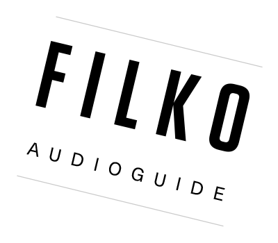

Filko Audio Guide
=================



This Audio Guide accompanies the ['STANO FILKO: POETRY ON SPACE – COSMOS'](http://www.sng.sk/en/exhibitions/729_stano-filko-poetry-on-space-cosmos) exhibition at the Slovak National Gallery, 24 June - 25 September 2016.
It is an open source mobile application built using PhoneGap (Apache Cordova), written entirely in HTML, CSS and JavaScript, and runs on numerous platforms (tested for iOS and Android).

The app uses:

* PhoneGap: http://www.phonegap.com
* jQuery Mobile: http://jquerymobile.com/
* jQuery.i18n https://github.com/wikimedia/jquery.i18n
* Mixpanel: https://mixpanel.com

## Installation

Requires [Node.js](https://nodejs.org/)

```
npm install -g phonegap
npm install  -g cordova-splash
phonegap plugin add cordova-plugin-media
phonegap plugin add cordova-plugin-inappbrowser
phonegap plugin add cordova-plugin-device
phonegap plugin add cordova-plugin-globalization
phonegap plugin add cordova-plugin-nativestorage
phonegap plugin add cordova-plugin-statusbar
phonegap plugin add cordova-plugin-splashscreen
phonegap plugin add cordova-plugin-mixpanel
```

## Usage

To start a local server to run the app in your browser:

```
phonegap serve
```

To test on your phone you can download the nifty [PhoneGap Developer mobile app](http://docs.phonegap.com/getting-started/2-install-mobile-app/) and point it to the Server Address you see after starting `phonegap serve`.

In case you receive an `Unable to download archive from the server` error in the PhoneGap Developer mobile app, it might help to create a WiFi hotspot on your phone, join this network on your computer, restart `phonegap serve` and connect again. See [this issue on Github](https://github.com/phonegap/phonegap-app-desktop/issues/360#issuecomment-103969087) for details.

### Event tracking with Mixpanel

We use [Mixpanel](https://mixpanel.com) to track basic usage of the app. The unique Mixpanel token is stored in `www/secrets.json`, which looks like:
```
{
    "mixpanelProductionToken":"YOUR_PRODUCTION_TOKEN_HERE"
    "mixpanelDevelopmentToken":"YOUR_DEVELOPMENT_TOKEN_HERE"
}
```

## Building Native Apps

More info on how to use Cordova to build native apps for various platform can be found on the [Cordova CLI documentation](https://cordova.apache.org/docs/en/latest/guide/cli). Since this app is already structured as a cordova app, you can skip straight to [adding platforms](https://cordova.apache.org/docs/en/latest/guide/cli/#add-platforms).

To generate splash-screens for all platforms (after platforms have been added):

```
cordova-splash
```